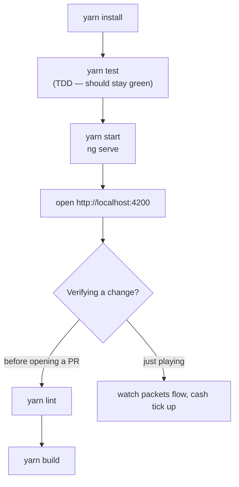
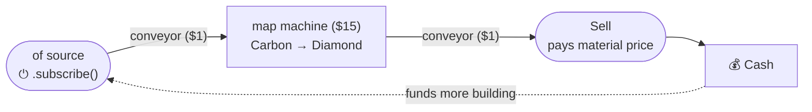
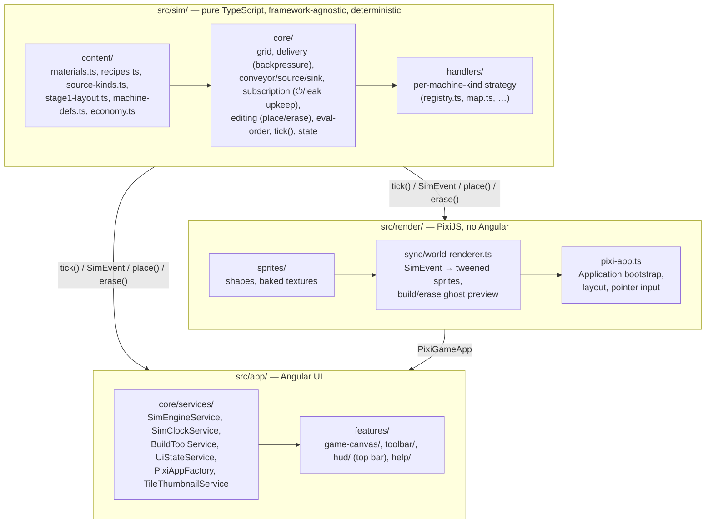

# ConveyRx

A browser game about running an automated mineral-extraction rig on a carbon-rich asteroid, that teaches
[RxJS](https://rxjs.dev) by turning its operators into buildable machines. You place conveyors and
operator-machines on a grid to wire a fixed **source** to a fixed **sell** block; packets (events) flow through
the network exactly the way values flow through an Observable pipeline — including backpressure (a literal
clogged belt when a downstream machine can't keep up) and subscription lifecycle (nothing is extracted, and
nothing costs anything, until you press the source's power button to `.subscribe()`).

Rendering is [PixiJS](https://pixijs.com) (procedurally-drawn sprites, no external art tools); application UI
(top bar, build toolbar, welcome/help dialog) is Angular. The two are kept strictly decoupled from the simulation
core — see [Project structure](#project-structure).

This repository currently implements **Stage 1**: a small buildable map (one `map` machine type available) with
real player interaction — drag-to-place conveyors (direction inferred from the drag, corners rendered as curves)
and machines/sources placed and erased for a refund, a cost economy, and an onboarding dialog — enough to prove
the tick engine, the editing/backpressure model, the Pixi rendering pipeline, and the Angular integration all work
end-to-end before more RxJS operators are layered on.

## Running the project

```bash
yarn install
yarn start      # dev server at http://localhost:4200
```



Other scripts (see `package.json`): `yarn test:ci` (non-watch, with coverage — what CI/agents should run),
`yarn lint`, `yarn build`. Package manager is **yarn only**; a `preinstall` guard blocks `npm`/`pnpm`.

## How the game works (player's perspective)

The map has two fixed anchors — a green **source** (an `of` extractor: a small power-button icon you click to
`.subscribe()`) and an amber **sell** block (a subscriber that pays you a material's value) — with empty
buildable cells between them. Nothing happens until _you_ wire them together and subscribe: pick a tool from the
toolbar (or press its shortcut letter, shown on the button), click/drag to build, then click the source itself to
switch it on. **Cursor** (or
`Esc`) drops you back to a plain pointer — click a placed block to select it, then `Delete`/`Backspace` erases it,
same refund as the Erase tool.



Two RxJS lessons are baked into the core loop from turn one:

- **Backpressure**: every conveyor cell holds at most one packet, and a machine won't accept a new packet until
  it has produced its output — so if anything downstream is slow, unbuilt, or full, the jam propagates backward
  and the source stops producing until room opens up.
- **Subscription lifecycle**: the `of` source emits a small _fixed_ batch of packets, then **completes** — it
  just sits there, still subscribed, still costing a tiny upkeep, producing nothing. That's a real memory leak:
  forgetting to unsubscribe from a finished/idle Observable still costs you. Toggling the source off then on
  again is what actually restarts it, exactly like calling `.subscribe()` a second time on a cold Observable.

`map` is deliberately _not_ an arbitrary math operator — it can only transform a material it's actually been
given, using a recipe chosen at build time (Carbon → Diamond today). A first playthrough is normally: lay a plain
conveyor line straight from source to sell and subscribe to get cash flowing, then swap a cell for the `map`
machine once you can afford it to start selling the refined (much more valuable) material instead of raw ore.
Later stages introduce more operators (`filter`, `scan`, `debounceTime`, `combineLatest`, `switchMap`, …) as new
machine types and `interval` as a third source kind, each built to mirror the real operator's semantics — see the
project plan for the full progression.

## Project structure (developer's perspective)

The codebase is split into three layers with a strict, one-directional dependency rule: the simulation core never
imports from rendering or the app layer, and rendering never imports from the app layer.



This boundary is enforced by an ESLint rule (`eslint.config.js`), not just convention: `sim/` is blocked from
importing `render/`, `app/`, `pixi.js`, or live RxJS timers (`interval`, `timer`) — the simulation must stay a
deterministic, fast-forwardable step function, since a future stage will use exactly that property to compute
offline/idle progress. Real time enters the system exactly once, in `SimClockService`, which ticks the engine on
an `interval(150)`.

`SimEngineService` mutates simulation entities in place for performance (important once a save can fast-forward
tens of thousands of ticks), then publishes a fresh top-level object to an Angular signal so change detection
sees it. One consequence: **never hold a `SimState` reference across a `tick()` call** — always re-read
`engine.state()`. `PixiAppFactory` exists purely as an injectable seam so `GameCanvasComponent` can be unit-tested
via Angular's `TestBed` provider overrides instead of mocking WebGL.

## Testing

TDD (red-green-refactor) throughout, using [Vitest](https://vitest.dev) via Angular's own test builder:

```bash
yarn test       # watch mode
yarn test:ci    # single run with coverage — thresholds enforced in angular.json
```

Almost everything is covered by real unit tests (196 tests, coverage comfortably above the thresholds in
`angular.json`), including the procedural sprite pipeline (texture baking, event-driven scene updates, tween
math) using PixiJS's real `Graphics`/`Container`/`Sprite`/`Text` classes, which run fine headlessly in jsdom as
long as nothing touches an actual GPU context. The one deliberate exception is `render/pixi-app.ts`: it calls
`Application.init()`, which needs a real WebGL context and can't be meaningfully unit-tested in jsdom — it's
verified by running the app in a real (headless) browser and watching it render instead.

## Contributing

See [CONTRIBUTING.md](./CONTRIBUTING.md) for the human-contributor workflow, and [AGENTS.md](./AGENTS.md) for the
Angular/TypeScript/testing/commit conventions this repo follows.

## Additional resources

- [Angular CLI Overview and Command Reference](https://angular.dev/tools/cli)
- [PixiJS v8 docs](https://pixijs.com/8.x/guides)
- [RxJS operator decision tree](https://rxjs.dev/operator-decision-tree) — the real semantics this game's
  machines are modeled on
